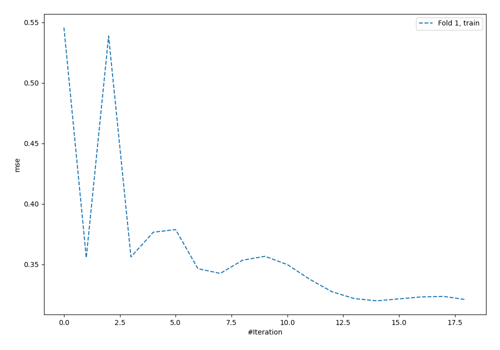
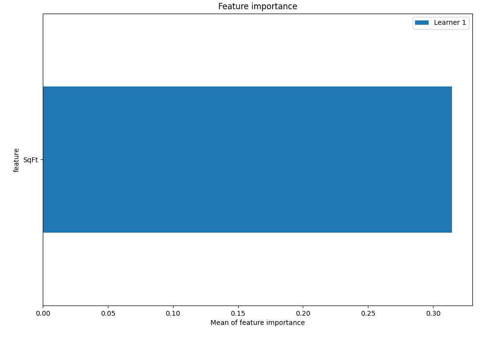
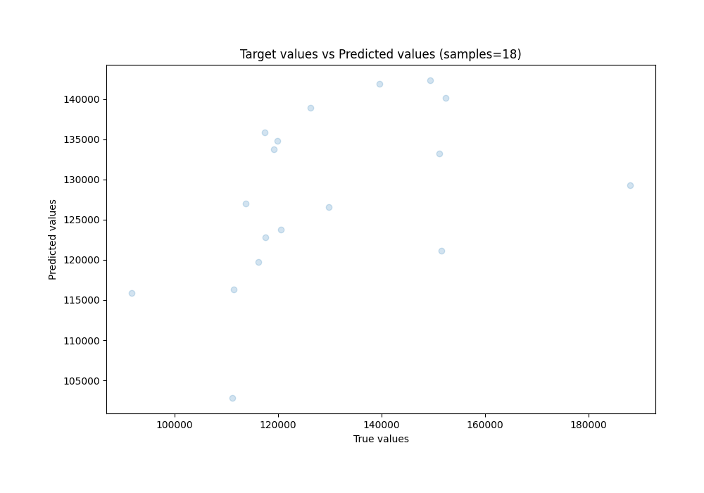
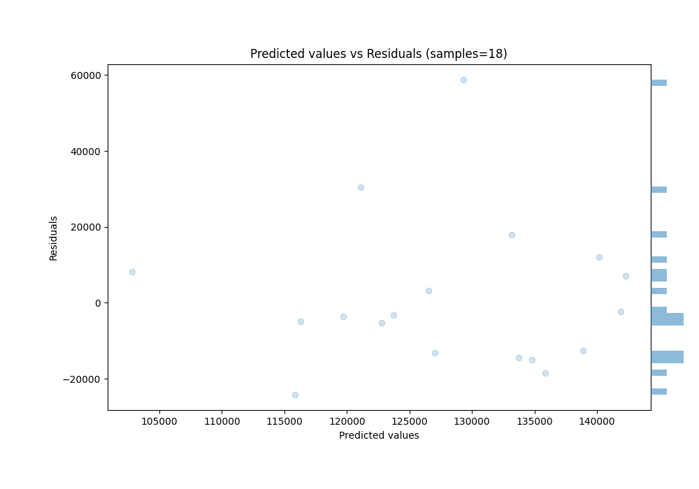

# Summary of 1_Default_NeuralNetwork

[<< Go back](../README.md)

## Neural Network
- **n_jobs**: -1
- **dense_1_size**: 32
- **dense_2_size**: 16
- **learning_rate**: 0.05
- **explain_level**: 2

## Validation
 - **validation_type**: split
 - **train_ratio**: 0.75
 - **shuffle**: True

## Optimized metric
rmse

## Training time

6.9 seconds

### Metric details:
| Metric   |           Score |
|:---------|----------------:|
| MAE      | 14164.7         |
| MSE      |     3.74805e+08 |
| RMSE     | 19359.9         |
| R2       |     0.20545     |
| MAPE     |     0.105793    |

## Learning curves

## Permutation-based Importance

## True vs Predicted

## Predicted vs Residuals

[<< Go back](../README.md)
